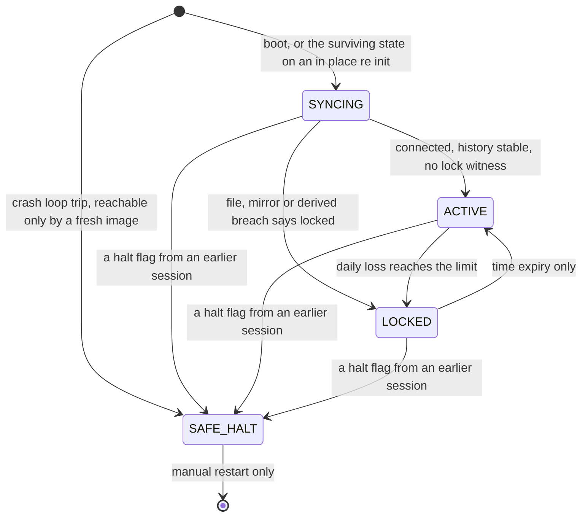

<!--TOKENS-->
**Dev Tool Usage** — updated 2026-08-16
Total: In 4.6K · Out 1.4M · CacheW 8.2M · CacheR 166.4M
| Model | In | Out | CacheW | CacheR |
|---|---|---|---|---|
| claude-sonnet-5 | 448 | 506.6K | 1.9M | 60.3M |
| claude-opus-5 | 590 | 363.8K | 3.2M | 58.2M |
| claude-fable-5 | 3.6K | 553.4K | 3.0M | 48.0M |
| <synthetic> | 0 | 0 | 0 | 0 |
<!--/TOKENS-->

<div align="center">

# AccountGuardian

**Account-level lockout `Expert Advisor` for `MetaTrader 5`.**


</div>

---

## At a glance

* Watches cumulative daily loss across the **whole account**, whatever opened the position: another advisor, the desktop terminal, or the mobile app.
* On breach it deletes every pending order, flattens every position, and locks until expiry. Unlock is **time expiry only**, with no manual override.
* Refuses to start on a malformed core input, and halts itself rather than acting when it believes its own code is broken.
* **This build does not trade.** Phase 0 is the survival skeleton. It contains no trading calls at all.

---

## Contents

* [What it is](#en-what-it-is)
* [The problem it solves](#en-problem)
* [The core guarantee](#en-guarantee)
* [Status, and what actually runs today](#en-status)
* [States](#en-states)
* [Survival mechanisms that exist today](#en-survival)
* [Requirements](#en-requirements)
* [Installation](#en-installation)
* [Configuration](#en-configuration)
* [What you will see in the journal](#en-journal)
* [Repository layout](#en-layout)
* [Design notes worth knowing](#en-design)
* [גרסה עברית](#he-top)

---

<a id="en-what-it-is"></a>

## 🛡️ What it is

A protection layer that runs on the whole trading account rather than on a
single trade or a single strategy. It watches cumulative daily loss across
everything on the account, no matter what opened the position: another
advisor, the desktop terminal, or the mobile app.

<a id="en-problem"></a>

## The problem it solves

A normal advisor protects only the trades it opened itself. Cumulative daily
loss across several advisors, plus manual trades opened by mistake, is not
stopped by anyone. AccountGuardian is the backstop that applies to all of it.

---

<a id="en-guarantee"></a>

## 🎯 The core guarantee

One number governs everything: the daily loss limit.

When daily loss reaches the limit, the guardian deletes every pending order
and flattens every open position on the account, then locks until expiry.
While locked, anything newly opened is flattened again within seconds of the
platform accepting a close for that symbol.

Two limits can be configured and the stricter one wins. `DailyLossPercent` is
a percentage of the day-anchor base, and `DailyLossCurrency` is a fixed
amount in account currency. Setting either to zero disables that one. Setting
both to zero is a configuration error and the advisor refuses to start.

Unlock happens by time expiry only. There is no manual override, no unlock
button, and no way to shorten a lock. For a daily breach the lock runs to the
next day anchor.

Weekly profit and loss is measured and reported only. No weekly code path can
lock, close, or sweep anything.

---

<a id="en-status"></a>

## 🚧 Status, and what actually runs today

The build in this repository is **Phase 0, the survival skeleton**. It is
important to be exact about what that means:

> **The current build contains no trading calls at all.** It does not measure
> profit and loss, it does not detect a breach, and it does not close
> anything. `Sweep.mqh` is deliberately empty of trade calls, and the whole
> build is checked for that by a static grep. Do not install this expecting
> your account to be protected today.

What Phase 0 does provide is everything the guardian needs in order to be
trustworthy later: it stays running, it refuses to run in a broken state, and
it never hides a failure.

| Area | Status |
|---|---|
| Event wiring, state machine, transition logging | ✅ implemented |
| Single-instance mutex with stale-holder takeover | ✅ implemented |
| Configuration validation, refuse on malformed core input | ✅ implemented |
| Crash-loop detection, halt file, `SAFE_HALT` | ✅ implemented |
| Proof-of-life logging, chart banner | ✅ implemented |
| Profit and loss engine, day and week windows | 🔜 planned, Phase 1 |
| Lock state file, expiry, boot derivation | 🔜 planned, Phase 2 |
| Sweep engine, flatten and pending deletion | 🔜 planned, Phase 3 |
| Weekly reporting | 🔜 planned, Phase 4 |

One consequence worth stating plainly: because the synchronisation exit
condition lands in Phase 1, the current build reaches `SYNCING` and stays
there. That is expected for this phase, and the proof-of-life line says so
explicitly on every emission rather than leaving you guessing.

---

<a id="en-states"></a>

## 🧭 States

Four states: `SYNCING`, `ACTIVE`, `LOCKED`, `SAFE_HALT`.



The diagram is the designed machine. In this build the `SYNCING` exit is not
implemented, so the edges out of it to `ACTIVE` and `LOCKED` are Phase 1 work.
`lock_reason` is one of `DAILY_BREACH` or `CORRUPT_STATE`, and a corrupt state
file locks from any state, which the diagram leaves out for readability.

| State | Meaning |
|---|---|
| `SYNCING` | Startup, while the terminal connection and trade history settle. Nothing is enforced until it exits. |
| `ACTIVE` | Normal operation. The limit is evaluated on every timer pass. |
| `LOCKED` | Entered on a daily breach, or on a corrupt state file. Sweeping is a behaviour of this state, not a separate state. |
| `SAFE_HALT` | The guardian believes its own code is malfunctioning. It closes nothing and sweeps nothing, because a guardian that cannot trust itself must not be allowed to act on the account. |

Every transition writes exactly one structured journal line carrying the
timestamp, the from-state, the to-state, the reason, and the governing
numbers.

---

<a id="en-survival"></a>

## 🔒 Survival mechanisms that exist today

These are the parts already built and tested, and they are the reason Phase 0
exists as its own phase.

<details>
<summary><strong>Single instance per account</strong></summary>

The first instance takes a mutex published as a global variable and refreshes
it on every timer tick. A second instance on the same account refuses to
start, raises an alert popup, writes a structured journal line naming the
account, and leaves the running instance untouched. If an instance dies
without releasing the mutex, its timestamp goes stale after a short threshold
and the next instance takes over deliberately and says so in the journal.

</details>

<details>
<summary><strong>Crash-loop detection</strong></summary>

Every start appends a session record to a halt file; a clean shutdown marks
that record clean. If more than `CrashLoopMaxInits` consecutive sessions end
without a clean shutdown, and each adjacent pair of starts is no further
apart than `CrashLoopWindowSeconds`, the guardian enters `SAFE_HALT`. A single
clean shutdown anywhere in the chain resets it, so ordinary restarts and
input changes never accumulate toward a halt.

</details>

<details>
<summary><strong><code>SAFE_HALT</code> with manual resume only</strong></summary>

The halt flag is written to disk and survives a terminal restart. Service
resumes only when a human deletes
`MQL5/Files/AccountGuardian/halt_<login>.dat` while the advisor is stopped,
and then restarts. There is no automatic recovery, deliberately: an advisor
that resumes itself after repeated crashes is an advisor that hides its own
failure. The alert names the exact file to delete.

</details>

<details>
<summary><strong>Never write a model that was never loaded</strong></summary>

If startup is refused before the halt file has been read, shutdown does not
write the file back. Writing a default-constructed model over it would erase
the session history and clear a persisted halt flag, which would turn a
refused start into a silent recovery. The skip is logged rather than silent.

</details>

<details>
<summary><strong>Proof of life</strong></summary>

Every state, including `SYNCING` and `LOCKED`, emits a journal line at a
fixed thirty second interval carrying the current state, seconds in state,
and the specific condition being waited on. A state that can be occupied
indefinitely while emitting nothing is treated as a defect, because a stuck
guardian and a healthy one must never look the same from the outside.

</details>

<details>
<summary><strong>Chart banner</strong></summary>

The chart always shows the current state, and a refusal leaves a dated
`REFUSED` banner in place rather than clearing it.

</details>

---

<a id="en-requirements"></a>

## Requirements

* `MetaTrader 5`, Windows.
* One terminal, one account. Scope is the entire account: no symbol filter
  and no magic-number filter.
* One chart. The advisor runs on a single chart, and closing that chart stops
  it.

<a id="en-installation"></a>

## 📦 Installation

1. Copy `MQL5/Experts/AccountGuardian/` and `MQL5/Include/AccountGuardian/`
   into the terminal data folder, keeping the same paths. Open the data
   folder from the terminal with `File` then `Open Data Folder`.
2. Compile `AccountGuardian.mq5` in `MetaEditor`. The build is expected to
   report zero errors and zero warnings.
3. Restart the terminal if you added preset files. A running terminal does
   not pick up files added to its data folder after it started.
4. Attach the advisor to one chart and confirm the input values in the
   properties dialog before accepting them.

Preset files for the input validation tests live in `docs/vectors/` in this
repository, and the copies the terminal actually reads live in
`MQL5/Presets/` inside the data folder.

---

<a id="en-configuration"></a>

## ⚙️ Configuration

Inputs fall into two classes, and the class decides what a bad value does.

**Core inputs** govern the limit and the lock. A malformed value refuses
startup with `INIT_PARAMETERS_INCORRECT` and a visible alert naming the
field. The advisor does not start in a degraded state.

**Optional inputs** govern reporting and cosmetics. A malformed value turns
that one feature off, logs a warning, and startup continues. A feature is
never half-enforced.

<details open>
<summary><strong>Input reference</strong></summary>

| Input | Type | Default | Class | On a bad value | Notes |
|---|---|---|---|---|---|
| `DailyLossPercent` | `double` | `5.0` | core | refuses startup | percent of day-anchor base, 0 disables |
| `DailyLossCurrency` | `double` | `0.0` | core | refuses startup | account currency, 0 disables, stricter of the two wins |
| `SweepPeriodSeconds` | `int` | `1` | core | refuses startup | timer period, refused outside 1 to 5 |
| `CrashLoopMaxInits` | `int` | `3` | core | refuses startup | consecutive unclean sessions tolerated |
| `CrashLoopWindowSeconds` | `int` | `300` | core | refuses startup | maximum gap between adjacent starts in a chain |
| `HistoryStablePolls` | `int` | `3` | core | refuses startup | synchronisation exit condition, used from Phase 1 |
| `WeeklyReportEnabled` | `bool` | `true` | optional | feature off plus warning | reporting path only |
| `LogVerbosity` | `enum` | `Normal` | optional | feature off plus warning | never suppresses transition lines |

</details>

Setting both daily limits to zero is refused. A guardian with no limit is a
configuration error, not a disabled feature.

---

<a id="en-journal"></a>

## 📓 What you will see in the journal

Alert popups are mandatory for breach, lock, unlock, state-write failure,
inability to trade while locked, and `SAFE_HALT`. Everything else goes to the
journal as structured lines. Raising `LogVerbosity` to `Verbose` adds
diagnostic detail; it never suppresses a transition line, and transitions and
proof-of-life lines are emitted at any verbosity.

<a id="en-layout"></a>

## Repository layout

<details>
<summary><strong>File map</strong></summary>

```
MQL5/Experts/AccountGuardian/AccountGuardian.mq5   entry point, event wiring only
MQL5/Include/AccountGuardian/State.mqh             state machine, transitions, reasons
MQL5/Include/AccountGuardian/Pnl.mqh               day and week windows, base, validation
MQL5/Include/AccountGuardian/Sweep.mqh             flatten engine, empty until Phase 3
MQL5/Include/AccountGuardian/Persist.mqh           halt file, state file, mutex, checksums
MQL5/Include/AccountGuardian/Clock.mqh             server time source, day and week anchors
MQL5/Include/AccountGuardian/Log.mqh               logging contract
docs/SPEC_v0.1.md                                  the specification the code is measured against
docs/vectors/                                      input validation preset files
```

</details>

---

<a id="en-design"></a>

## 🧩 Design notes worth knowing

<details>
<summary><strong>Why only one clock source</strong></summary>

Time decisions use `TimeCurrent` exclusively. `TimeTradeServer` and
`TimeLocal` are excluded from decision paths because they can be moved by
changing the local Windows clock. The cost is that expiry in a dead market
waits for the next server update, which errs on the side of staying locked.

</details>

<details>
<summary><strong>Why the trade API lives in one file</strong></summary>

The trade API is reachable from `Sweep.mqh` and nowhere else. This is a
structural rule that can be checked without running the code, and it is what
makes the reporting path provably unable to trade.

</details>

<details>
<summary><strong>Why the base is rebuilt rather than cached</strong></summary>

Deposits and withdrawals must not move loss headroom in either direction. The
base is reconstructed live from the day anchor rather than cached, so a
deposit cannot quietly enlarge the amount you are allowed to lose.

</details>

<br />

***

<div align="center">

### גרסה עברית

</div>

***

<br />

<a id="he-top"></a>

<div align="center">

# AccountGuardian

**`Expert Advisor` לנעילה ברמת חשבון עבור `MetaTrader 5`.**


</div>

---

## במבט מהיר

* עוקבת אחרי ההפסד היומי המצטבר ב**חשבון כולו**, בלי קשר לשאלה מי פתח את הפוזיציה: יועץ אחר, הטרמינל במחשב, או האפליקציה בנייד.
* בהפרה היא מוחקת כל פקודה ממתינה, סוגרת כל פוזיציה, ונועלת עד לפקיעה. השחרור הוא **בפקיעת זמן בלבד**, בלי עקיפה ידנית.
* מסרבת לעלות על קלט ליבה פגום, ועוצרת את עצמה במקום לפעול כשהיא מאמינה שהקוד שלה עצמו שבור.
* **הגרסה הזו אינה סוחרת.** שלב 0 הוא שלד ההישרדות. אין בו שום קריאת מסחר.

---

## תוכן העניינים

* [מה זה](#he-what-it-is)
* [הבעיה שהיא פותרת](#he-problem)
* [ההבטחה המרכזית](#he-guarantee)
* [סטטוס, ומה באמת רץ היום](#he-status)
* [מצבים](#he-states)
* [מנגנוני הישרדות שקיימים היום](#he-survival)
* [דרישות](#he-requirements)
* [התקנה](#he-installation)
* [הגדרות](#he-configuration)
* [מה רואים ביומן](#he-journal)
* [מבנה הריפו](#he-layout)
* [הערות תכנון שכדאי להכיר](#he-design)

---

<a id="he-what-it-is"></a>

## 🛡️ מה זה

שכבת הגנה שרצה על חשבון המסחר כולו ולא על עסקה בודדת או אסטרטגיה בודדת.
היא עוקבת אחרי ההפסד היומי המצטבר בכל החשבון, בלי קשר לשאלה מי פתח את
הפוזיציה: יועץ אחר, הטרמינל במחשב, או האפליקציה בנייד.

<a id="he-problem"></a>

## הבעיה שהיא פותרת

יועץ רגיל מגן רק על העסקאות שהוא עצמו פתח. הפסד יומי מצטבר על פני כמה
יועצים, יחד עם עסקאות ידניות שנפתחו בטעות, לא נעצר על ידי אף אחד. השכבה
הזו היא הבלם שחל על הכל.

---

<a id="he-guarantee"></a>

## 🎯 ההבטחה המרכזית

מספר אחד קובע הכל: מגבלת ההפסד היומי.

כשההפסד היומי מגיע למגבלה, השומר מוחק כל פקודה ממתינה וסוגר כל פוזיציה
פתוחה בחשבון, ואז נועל עד לפקיעה. בזמן הנעילה, כל דבר שנפתח מחדש נסגר שוב
תוך שניות מהרגע שהפלטפורמה מאשרת סגירה לאותו סימבול.

אפשר להגדיר שתי מגבלות והמחמירה מביניהן גוברת. `DailyLossPercent` הוא אחוז
מהבסיס של תחילת היום, ו `DailyLossCurrency` הוא סכום קבוע במטבע החשבון.
אפס מבטל כל אחת מהן בנפרד. אפס בשתיהן הוא שגיאת הגדרה, והיועץ מסרב לעלות.

השחרור מתרחש רק בפקיעת זמן. אין עקיפה ידנית, אין כפתור שחרור, ואין דרך
לקצר נעילה. בהפרה יומית הנעילה נמשכת עד עוגן היום הבא.

מדידת רווח והפסד שבועית היא לדיווח בלבד. שום נתיב שבועי אינו יכול לנעול,
לסגור או לסרוק.

---

<a id="he-status"></a>

## 🚧 סטטוס, ומה באמת רץ היום

הגרסה בריפו הזה היא **שלב 0, שלד ההישרדות**. חשוב לדייק במשמעות:

> **הגרסה הנוכחית אינה מכילה שום קריאת מסחר.** היא אינה מודדת רווח והפסד,
> אינה מזהה הפרה, ואינה סוגרת דבר. הקובץ `Sweep.mqh` ריק במכוון מקריאות
> מסחר, וכל הבנייה נבדקת על כך בסריקה סטטית. אין להתקין אותה מתוך ציפייה
> שהחשבון מוגן היום.

מה ששלב 0 כן מספק הוא כל מה שהשומר צריך כדי להיות אמין בהמשך: הוא נשאר
לרוץ, הוא מסרב לרוץ במצב פגום, והוא לעולם אינו מסתיר תקלה.

| תחום | מצב |
|---|---|
| חיווט אירועים, מכונת מצבים, תיעוד מעברים | ✅ ממומש |
| מנעול מופע יחיד עם השתלטות על מחזיק תקוע | ✅ ממומש |
| אימות הגדרות וסירוב על קלט ליבה פגום | ✅ ממומש |
| זיהוי לולאת קריסה, קובץ עצירה, `SAFE_HALT` | ✅ ממומש |
| תיעוד סימני חיים, כרזה על הגרף | ✅ ממומש |
| מנוע רווח והפסד, חלונות יום ושבוע | 🔜 מתוכנן, שלב 1 |
| קובץ מצב נעילה, פקיעה, גזירה בעלייה | 🔜 מתוכנן, שלב 2 |
| מנוע סריקה, סגירה ומחיקת ממתינות | 🔜 מתוכנן, שלב 3 |
| דיווח שבועי | 🔜 מתוכנן, שלב 4 |

השלכה אחת שראוי לומר במפורש: מכיוון שתנאי היציאה מהסנכרון נוחת בשלב 1,
הגרסה הנוכחית מגיעה למצב `SYNCING` ונשארת בו. זה צפוי בשלב הזה, ושורת
סימני החיים אומרת זאת במפורש בכל פליטה במקום להשאיר את הקורא בניחושים.

---

<a id="he-states"></a>

## 🧭 מצבים

ארבעה מצבים: `SYNCING`, `ACTIVE`, `LOCKED`, `SAFE_HALT`.

תרשים מכונת המצבים מופיע פעם אחת בלבד, בחלק האנגלי:
[state diagram](#en-states).
הוא מוצג שם ולא כאן מפני שתרשים מסוג `mermaid` בהקשר של כתיבה מימין לשמאל
עלול להיפרס בצורה שגויה, והכפלת התרשים הייתה יוצרת שני מקורות לאותה אמת.
התרשים מתאר את המכונה המתוכננת. בגרסה הזו היציאה ממצב `SYNCING` אינה
ממומשת, ולכן הקשתות היוצאות ממנו הן עבודה של שלב 1. הערך `lock_reason` הוא
`DAILY_BREACH` או `CORRUPT_STATE`, וקובץ מצב פגום נועל מכל מצב, מה שהושמט
מהתרשים לטובת הקריאוּת.

| מצב | משמעות |
|---|---|
| `SYNCING` | עלייה, בזמן שחיבור הטרמינל והיסטוריית העסקאות מתייצבים. שום דבר אינו נאכף עד היציאה ממנו. |
| `ACTIVE` | מצב עבודה רגיל. המגבלה נבדקת בכל מחזור טיימר. |
| `LOCKED` | נכנס בהפרה יומית, או בקובץ מצב פגום. הסריקה היא התנהגות של המצב הזה ולא מצב נפרד. |
| `SAFE_HALT` | השומר מאמין שהקוד שלו עצמו פגום. הוא אינו סוגר דבר ואינו סורק דבר, כי שומר שאינו יכול לסמוך על עצמו אסור שיפעל על החשבון. |

כל מעבר כותב שורת יומן מובנית אחת בדיוק, הנושאת חותמת זמן, מצב מוצא, מצב
יעד, סיבה, והמספרים הקובעים.

---

<a id="he-survival"></a>

## 🔒 מנגנוני הישרדות שקיימים היום

אלה החלקים שכבר נבנו ונבדקו, והם הסיבה ששלב 0 קיים כשלב נפרד.

<details>
<summary><strong>מופע יחיד לכל חשבון</strong></summary>

המופע הראשון תופס מנעול שמתפרסם כמשתנה גלובלי ומרענן אותו בכל פעימת
טיימר. מופע שני על אותו חשבון מסרב לעלות, מרים חלון התראה, כותב שורת יומן
מובנית הנוקבת במספר החשבון, ומשאיר את המופע הרץ ללא פגיעה. אם מופע מת בלי
לשחרר את המנעול, חותמת הזמן שלו מתיישנת אחרי סף קצר והמופע הבא משתלט
במפורש ומתעד זאת.

</details>

<details>
<summary><strong>זיהוי לולאת קריסה</strong></summary>

כל עלייה מוסיפה רשומת הרצה לקובץ עצירה, וכיבוי נקי מסמן את הרשומה כנקייה.
אם יותר מ `CrashLoopMaxInits` הרצות רצופות מסתיימות בלי כיבוי נקי, וכל זוג
עליות סמוכות מרוחק לכל היותר `CrashLoopWindowSeconds`, השומר נכנס למצב
`SAFE_HALT`. כיבוי נקי אחד בכל מקום בשרשרת מאפס אותה, ולכן הפעלות מחדש
רגילות ושינויי קלט לעולם אינם מצטברים לעצירה.

</details>

<details>
<summary><strong>עצירה בטוחה עם חידוש ידני בלבד</strong></summary>

דגל העצירה נכתב לדיסק ושורד הפעלה מחדש של הטרמינל. השירות מתחדש רק כאשר
אדם מוחק את הקובץ `MQL5/Files/AccountGuardian/halt_<login>.dat` בזמן
שהיועץ מופסק, ואז מפעיל מחדש. אין התאוששות אוטומטית, וזה במכוון: יועץ
שמחדש את עצמו אחרי קריסות חוזרות הוא יועץ שמסתיר את התקלה שלו. ההתראה
נוקבת בשם הקובץ המדויק למחיקה.

</details>

<details>
<summary><strong>לעולם לא לכתוב מודל שמעולם לא נטען</strong></summary>

אם העלייה נדחתה לפני שקובץ העצירה נקרא, הכיבוי אינו כותב את הקובץ בחזרה.
כתיבת מודל ריק על גביו הייתה מוחקת את היסטוריית ההרצות ומנקה דגל עצירה
שנשמר, והופכת עלייה שנדחתה להתאוששות שקטה. הדילוג מתועד ואינו שקט.

</details>

<details>
<summary><strong>סימני חיים</strong></summary>

כל מצב, כולל `SYNCING` ו `LOCKED`, פולט שורת יומן במרווח קבוע של שלושים
שניות הנושאת את המצב הנוכחי, שניות במצב, והתנאי המסוים שממתינים לו. מצב
שאפשר לשהות בו ללא הגבלה בלי לפלוט דבר נחשב לפגם, כי שומר תקוע ושומר תקין
אסור שייראו זהים מבחוץ.

</details>

<details>
<summary><strong>כרזה על הגרף</strong></summary>

הגרף מציג תמיד את המצב הנוכחי, וסירוב משאיר כרזת `REFUSED` מתוארכת במקומה
במקום לנקות אותה.

</details>

---

<a id="he-requirements"></a>

## דרישות

* `MetaTrader 5`, `Windows`.
* טרמינל אחד, חשבון אחד. ההיקף הוא כל החשבון: בלי סינון לפי סימבול ובלי
  סינון לפי מספר קסם.
* גרף אחד. היועץ רץ על גרף בודד, וסגירת אותו גרף עוצרת אותו.

<a id="he-installation"></a>

## 📦 התקנה

1. העתיקו את `MQL5/Experts/AccountGuardian/` ואת
   `MQL5/Include/AccountGuardian/` לתיקיית הנתונים של הטרמינל, תוך שמירה
   על אותם נתיבים. פותחים את תיקיית הנתונים מהטרמינל דרך `File` ואז
   `Open Data Folder`.
2. הדרו את `AccountGuardian.mq5` בתוך `MetaEditor`. הבנייה אמורה לדווח
   אפס שגיאות ואפס אזהרות.
3. הפעילו מחדש את הטרמינל אם הוספתם קבצי הגדרות מוכנות. טרמינל שכבר רץ
   אינו קולט קבצים שנוספו לתיקיית הנתונים שלו אחרי שעלה.
4. חברו את היועץ לגרף אחד ואשרו את ערכי הקלט בחלון המאפיינים לפני קבלתם.

קבצי ההגדרות לבדיקות אימות הקלט נמצאים בתיקייה `docs/vectors/` בריפו הזה,
והעותקים שהטרמינל באמת קורא נמצאים בתיקייה `MQL5/Presets/` בתוך תיקיית
הנתונים.

---

<a id="he-configuration"></a>

## ⚙️ הגדרות

הקלטים מתחלקים לשתי מחלקות, והמחלקה קובעת מה קורה כשהערך פגום.

**קלטי ליבה** קובעים את המגבלה ואת הנעילה. ערך פגום דוחה את העלייה עם
`INIT_PARAMETERS_INCORRECT` ועם התראה גלויה הנוקבת בשם השדה. היועץ אינו
עולה במצב מדורדר.

**קלטים אופציונליים** קובעים דיווח ונוחות. ערך פגום מכבה את אותה תכונה
בלבד, כותב אזהרה, והעלייה נמשכת. תכונה לעולם אינה נאכפת למחצה.

<details open>
<summary><strong>טבלת הקלטים</strong></summary>

| קלט | טיפוס | ברירת מחדל | מחלקה | בערך פגום | הערות |
|---|---|---|---|---|---|
| `DailyLossPercent` | `double` | `5.0` | ליבה | דוחה את העלייה | אחוז מבסיס תחילת היום, אפס מבטל |
| `DailyLossCurrency` | `double` | `0.0` | ליבה | דוחה את העלייה | מטבע החשבון, אפס מבטל, המחמירה גוברת |
| `SweepPeriodSeconds` | `int` | `1` | ליבה | דוחה את העלייה | מחזור הטיימר, נדחה מחוץ לטווח 1 עד 5 |
| `CrashLoopMaxInits` | `int` | `3` | ליבה | דוחה את העלייה | הרצות רצופות לא נקיות שנסבלות |
| `CrashLoopWindowSeconds` | `int` | `300` | ליבה | דוחה את העלייה | מרווח מרבי בין עליות סמוכות בשרשרת |
| `HistoryStablePolls` | `int` | `3` | ליבה | דוחה את העלייה | תנאי יציאה מסנכרון, בשימוש משלב 1 |
| `WeeklyReportEnabled` | `bool` | `true` | אופציונלי | התכונה כבויה בתוספת אזהרה | נתיב דיווח בלבד |
| `LogVerbosity` | `enum` | `Normal` | אופציונלי | התכונה כבויה בתוספת אזהרה | לעולם אינו משתיק שורות מעבר |

</details>

הגדרת שתי מגבלות ההפסד היומי לאפס נדחית. שומר בלי מגבלה הוא שגיאת הגדרה
ולא תכונה מבוטלת.

---

<a id="he-journal"></a>

## 📓 מה רואים ביומן

חלונות התראה הם חובה עבור הפרה, נעילה, שחרור, כישלון כתיבת מצב, חוסר
יכולת לסחור בזמן נעילה, ו `SAFE_HALT`. כל השאר נכתב ליומן כשורות מובנות.
העלאת `LogVerbosity` למצב `Verbose` מוסיפה פירוט אבחוני, היא לעולם אינה
משתיקה שורת מעבר, ושורות מעבר וסימני חיים נפלטות בכל רמת פירוט.

<a id="he-layout"></a>

## מבנה הריפו

<details>
<summary><strong>מפת הקבצים</strong></summary>

```
MQL5/Experts/AccountGuardian/AccountGuardian.mq5   נקודת כניסה, חיווט אירועים בלבד
MQL5/Include/AccountGuardian/State.mqh             מכונת מצבים, מעברים, סיבות
MQL5/Include/AccountGuardian/Pnl.mqh               חלונות יום ושבוע, בסיס, אימות
MQL5/Include/AccountGuardian/Sweep.mqh             מנוע סגירה, ריק עד שלב 3
MQL5/Include/AccountGuardian/Persist.mqh           קובץ עצירה, קובץ מצב, מנעול, סכומי ביקורת
MQL5/Include/AccountGuardian/Clock.mqh             מקור זמן השרת, עוגני יום ושבוע
MQL5/Include/AccountGuardian/Log.mqh               חוזה התיעוד
docs/SPEC_v0.1.md                                  המפרט שהקוד נמדד מולו
docs/vectors/                                      קבצי הגדרות לאימות קלט
```

</details>

---

<a id="he-design"></a>

## 🧩 הערות תכנון שכדאי להכיר

<details>
<summary><strong>למה מקור זמן אחד בלבד</strong></summary>

החלטות זמן משתמשות ב `TimeCurrent` בלבד. הפונקציות `TimeTradeServer` ו
`TimeLocal` מוחרגות מנתיבי החלטה מפני שאפשר להזיז אותן בשינוי שעון
`Windows` המקומי. המחיר הוא שפקיעה בשוק מת ממתינה לעדכון השרת הבא, וזה
נוטה לצד של להישאר נעול.

</details>

<details>
<summary><strong>למה ממשק המסחר יושב בקובץ אחד</strong></summary>

ממשק המסחר נגיש מהקובץ `Sweep.mqh` ומשום מקום אחר. זהו כלל מבני שאפשר
לבדוק בלי להריץ את הקוד, והוא מה שהופך את נתיב הדיווח לבלתי מסוגל לסחור
באופן מוכח.

</details>

<details>
<summary><strong>למה הבסיס נבנה מחדש ולא נשמר במטמון</strong></summary>

הפקדות ומשיכות אינן אמורות להזיז את מרווח ההפסד לאף כיוון. הבסיס נבנה
מחדש בזמן אמת מעוגן היום ולא נשמר במטמון, ולכן הפקדה אינה יכולה להגדיל
בשקט את הסכום שמותר להפסיד.

</details>
