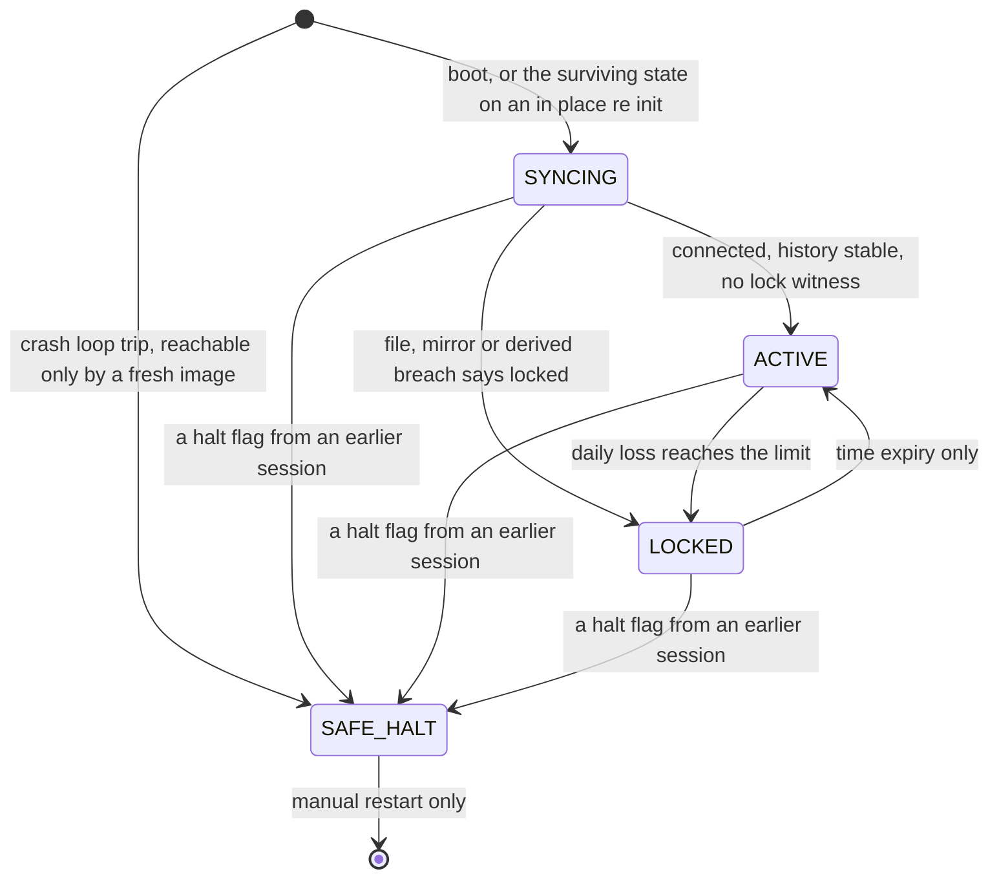

<div align="center">

# AccountGuardian

**Account-level lockout `Expert Advisor` for `MetaTrader 5`.**


</div>

---

## At a glance

* Watches cumulative daily loss across the **whole account**, whatever opened the position: another advisor, the desktop terminal, or the mobile app.
* On breach it locks the account and persists the lock to disk so a restart cannot clear it early. Unlock is **time expiry only**, with no manual override.
* Refuses to start on a malformed core input, and halts itself rather than acting when it believes its own code is broken.
* **This build detects and locks. It does not yet close anything.** The engine that would delete pending orders and flatten positions on a lock is Phase 3 and has not shipped, so an open position stays open through a lock today.

---

## Contents

* [What it is](#en-what-it-is)
* [The problem it solves](#en-problem)
* [The core guarantee](#en-guarantee)
* [Status, and what actually runs today](#en-status)
* [States](#en-states)
* [Survival mechanisms that exist today](#en-survival)
* [Requirements](#en-requirements)
* [Installation](#en-installation)
* [Configuration](#en-configuration)
* [What you will see in the journal](#en-journal)
* [Repository layout](#en-layout)
* [Known open defects](#en-known)
* [Design notes worth knowing](#en-design)
* [גרסה עברית](#he-top)

---

<a id="en-what-it-is"></a>

## 🛡️ What it is

A protection layer that runs on the whole trading account rather than on a
single trade or a single strategy. It watches cumulative daily loss across
everything on the account, no matter what opened the position: another
advisor, the desktop terminal, or the mobile app.

<a id="en-problem"></a>

## The problem it solves

A normal advisor protects only the trades it opened itself. Cumulative daily
loss across several advisors, plus manual trades opened by mistake, is not
stopped by anyone. AccountGuardian is the backstop that applies to all of it.

---

<a id="en-guarantee"></a>

## 🎯 The core guarantee

One number governs everything: the daily loss limit.

When daily loss reaches the limit, the guardian locks the account until
expiry. By design, that lock deletes every pending order and flattens every
open position, and anything newly opened while locked is flattened again
within seconds. The engine that performs the flatten and the pending-order
deletion has not shipped yet, so today the lock is enforced by state and
alert only, and an open position stays open through it. See Status below.

Two limits can be configured and the stricter one wins. `DailyLossPercent` is
a percentage of the day-anchor base, and `DailyLossCurrency` is a fixed
amount in account currency. Setting either to zero disables that one. Setting
both to zero is a configuration error and the advisor refuses to start.

Unlock happens by time expiry only. There is no manual override, no unlock
button, and no way to shorten a lock. For a daily breach the lock runs to the
next day anchor.

Weekly profit and loss is designed to be measured and reported only, never to
lock, close, or sweep anything. That measurement has not shipped yet, only
the input flag that will govern it exists today.

---

<a id="en-status"></a>

## 🚧 Status, and what actually runs today

The build in this repository has closed **Phase 0 through Phase 2**. It is
important to be exact about what that means:

> **The current build measures cumulative daily loss, detects a breach, and
> locks the account by state and by a lock file that survives a restart.**
> All of that has run on a live account, including a real breach, a real
> broker liquidation, and a lock that persisted across a terminal restart and
> an unplanned reboot. **It does not close anything yet.** `Sweep.mqh`, the
> file that would flatten positions and delete pending orders, is still
> deliberately empty of trade calls, and the whole build is checked for that
> by a static grep. A breach today locks the state and alerts loudly; it does
> not touch a position.

| Area | Status |
|---|---|
| Event wiring, state machine, transition logging | ✅ implemented |
| Single-instance mutex with stale-holder takeover | ✅ implemented |
| Configuration validation, refuse on malformed core input | ✅ implemented |
| Crash-loop detection, halt file, `SAFE_HALT` | ✅ implemented |
| Proof-of-life logging, chart banner | ✅ implemented |
| Daily profit and loss engine, day anchor, ratcheted floor | ✅ implemented |
| Breach detection, account-wide `LOCKED` state | ✅ implemented |
| Lock persistence and boot-derived lock, three independent witnesses | ✅ implemented |
| `SYNCING` exit condition, history stability polls | ✅ implemented |
| Weekly measurement and reporting | 🔜 planned |
| Sweep engine, flatten positions and delete pending orders on a lock | 🔜 planned, Phase 3 |
| Blocking new trades from opening while locked | 🔜 planned, later phase |

---

<a id="en-states"></a>

## 🧭 States

Four states: `SYNCING`, `ACTIVE`, `LOCKED`, `SAFE_HALT`.



The diagram is the designed machine, and this build implements every edge on
it. The `SYNCING` exit, entry into `LOCKED` on a fresh breach or on a lock
found at boot, and the expiry-only path back to `ACTIVE`, have each fired on a
live account. `lock_reason` is one of `DAILY_BREACH` or `CORRUPT_STATE`, and a
corrupt state file locks from any state, which the diagram leaves out for
readability.

| State | Meaning |
|---|---|
| `SYNCING` | Startup, while the terminal connection and trade history settle. Nothing is enforced until it exits. |
| `ACTIVE` | Normal operation. The limit is evaluated on every timer pass. |
| `LOCKED` | Entered on a daily breach, or on a corrupt state file, and persisted so a restart cannot clear it early. Sweeping is designed as a behaviour of this state rather than a separate one, but the sweep engine itself has not shipped yet, see Status. |
| `SAFE_HALT` | The guardian believes its own code is malfunctioning. It closes nothing and sweeps nothing, because a guardian that cannot trust itself must not be allowed to act on the account. |

Every transition writes exactly one structured journal line carrying the
timestamp, the from-state, the to-state, the reason, and the governing
numbers.

---

<a id="en-survival"></a>

## 🔒 Survival mechanisms that exist today

These are the parts already built and tested, and they are the reason Phase 0
exists as its own phase.

<details>
<summary><strong>Single instance per account</strong></summary>

The first instance takes a mutex published as a global variable and refreshes
it on every timer tick. A second instance on the same account refuses to
start, raises an alert popup, writes a structured journal line naming the
account, and leaves the running instance untouched. If an instance dies
without releasing the mutex, its timestamp goes stale after a short threshold
and the next instance takes over deliberately and says so in the journal.

</details>

<details>
<summary><strong>Crash-loop detection</strong></summary>

Every start appends a session record to a halt file; a clean shutdown marks
that record clean. If more than `CrashLoopMaxInits` consecutive sessions end
without a clean shutdown, and each adjacent pair of starts is no further
apart than `CrashLoopWindowSeconds`, the guardian enters `SAFE_HALT`. A single
clean shutdown anywhere in the chain resets it, so ordinary restarts and
input changes never accumulate toward a halt.

</details>

<details>
<summary><strong><code>SAFE_HALT</code> with manual resume only</strong></summary>

The halt flag is written to disk and survives a terminal restart. Service
resumes only when a human deletes
`MQL5/Files/AccountGuardian/halt_<login>.dat` while the advisor is stopped,
and then restarts. There is no automatic recovery, deliberately: an advisor
that resumes itself after repeated crashes is an advisor that hides its own
failure. The alert names the exact file to delete.

</details>

<details>
<summary><strong>Never write a model that was never loaded</strong></summary>

If startup is refused before the halt file has been read, shutdown does not
write the file back. Writing a default-constructed model over it would erase
the session history and clear a persisted halt flag, which would turn a
refused start into a silent recovery. The skip is logged rather than silent.

</details>

<details>
<summary><strong>Proof of life</strong></summary>

Every state, including `SYNCING` and `LOCKED`, emits a journal line at a
fixed thirty second interval carrying the current state, seconds in state,
and the specific condition being waited on. A state that can be occupied
indefinitely while emitting nothing is treated as a defect, because a stuck
guardian and a healthy one must never look the same from the outside.

</details>

<details>
<summary><strong>Chart banner</strong></summary>

The chart always shows the current state, and a refusal leaves a dated
`REFUSED` banner in place rather than clearing it.

</details>

---

<a id="en-requirements"></a>

## Requirements

* `MetaTrader 5`, Windows.
* One terminal, one account. Scope is the entire account: no symbol filter
  and no magic-number filter.
* One chart. The advisor runs on a single chart, and closing that chart stops
  it.

<a id="en-installation"></a>

## 📦 Installation

1. Copy `MQL5/Experts/AccountGuardian/` and `MQL5/Include/AccountGuardian/`
   into the terminal data folder, keeping the same paths. Open the data
   folder from the terminal with `File` then `Open Data Folder`.
2. Compile `AccountGuardian.mq5` in `MetaEditor`. The build is expected to
   report zero errors and zero warnings.
3. Restart the terminal if you added preset files. A running terminal does
   not pick up files added to its data folder after it started.
4. Attach the advisor to one chart and confirm the input values in the
   properties dialog before accepting them.

Preset files for the input validation tests live in `docs/vectors/` in this
repository, and the copies the terminal actually reads live in
`MQL5/Presets/` inside the data folder.

---

<a id="en-configuration"></a>

## ⚙️ Configuration

Inputs fall into two classes, and the class decides what a bad value does.

**Core inputs** govern the limit and the lock. A malformed value refuses
startup with `INIT_PARAMETERS_INCORRECT` and a visible alert naming the
field. The advisor does not start in a degraded state.

**Optional inputs** govern reporting and cosmetics. A malformed value turns
that one feature off, logs a warning, and startup continues. A feature is
never half-enforced.

<details open>
<summary><strong>Input reference</strong></summary>

| Input | Type | Default | Class | On a bad value | Notes |
|---|---|---|---|---|---|
| `DailyLossPercent` | `double` | `5.0` | core | refuses startup | percent of day-anchor base, 0 disables |
| `DailyLossCurrency` | `double` | `0.0` | core | refuses startup | account currency, 0 disables, stricter of the two wins |
| `SweepPeriodSeconds` | `int` | `1` | core | refuses startup | timer period, refused outside 1 to 5 |
| `CrashLoopMaxInits` | `int` | `3` | core | refuses startup | consecutive unclean sessions tolerated |
| `CrashLoopWindowSeconds` | `int` | `300` | core | refuses startup | maximum gap between adjacent starts in a chain |
| `HistoryStablePolls` | `int` | `3` | core | refuses startup | synchronisation exit condition, used from Phase 1 |
| `WeeklyReportEnabled` | `bool` | `true` | optional | feature off plus warning | reporting path only |
| `LogVerbosity` | `enum` | `Normal` | optional | feature off plus warning | never suppresses transition lines |

</details>

Setting both daily limits to zero is refused. A guardian with no limit is a
configuration error, not a disabled feature.

---

<a id="en-journal"></a>

## 📓 What you will see in the journal

Alert popups are mandatory for breach, lock, unlock, state-write failure,
inability to trade while locked, and `SAFE_HALT`. Everything else goes to the
journal as structured lines. Raising `LogVerbosity` to `Verbose` adds
diagnostic detail; it never suppresses a transition line, and transitions and
proof-of-life lines are emitted at any verbosity.

<a id="en-layout"></a>

## Repository layout

<details>
<summary><strong>File map</strong></summary>

```
MQL5/Experts/AccountGuardian/AccountGuardian.mq5   entry point, event wiring only
MQL5/Include/AccountGuardian/State.mqh             state machine, transitions, reasons
MQL5/Include/AccountGuardian/Pnl.mqh               day and week windows, base, validation
MQL5/Include/AccountGuardian/Sweep.mqh             flatten engine, declarations only until Phase 3
MQL5/Include/AccountGuardian/Persist.mqh           halt file, state file, mutex, checksums
MQL5/Include/AccountGuardian/Clock.mqh             server time source, day and week anchors
MQL5/Include/AccountGuardian/Log.mqh               logging contract
MQL5/Scripts/AccountGuardian/                      vector-capture scripts for the clock and state tests
LEDGER.md                                          issues, actions and decisions, the project's record
docs/SPEC_v0.1.md                                  the specification the code is measured against
docs/PLAN_PHASE0.md · docs/PLAN_PHASE1_PNL_CORE.md · docs/DESIGN_PHASE1_2.md
docs/REVIEW_v0.md                                  the review the hardening work answers
docs/vectors/                                      input validation preset files
docs/evidence/                                     banked journals, state files and vector captures
docs/residue/                                      a preserved corrupt-state artifact
docs/status/index.html                             a static status view
scripts/agtest.ps1                                 test driver
```

`Sweep.mqh` is not an empty file: it holds the Phase 3 contract as comments and declarations,
with no trade API reference at all. That absence is what the static grep checks.

</details>

---

<a id="en-known"></a>

## 🐞 Known open defects

The build that locked a live account is the build under acceptance, so findings raised during
that acceptance were recorded rather than patched mid-stage. [`LEDGER.md`](LEDGER.md) is the
record — it currently carries **26 open and 5 blocked entries** across issues, actions and
decisions. The ones that change what you should expect from a running instance:

| Defect | Effect today |
|---|---|
| The global-variable lock mirror is overwritten with `0` on the first ticks of every cold boot, before its own witness reads it | The third independent lock-recovery witness fires only when the advisor kept its memory. With the state file deleted, restart recovery rests on the derived history witness alone. Confirmed on two independent cold boots. |
| A boot-derived lock persists an empty Q6 snapshot and loses `breach_at` | Not an enforcement hole — the file witness re-fires on reason plus an unexpired `locked_until` — but the breach timestamp is lost permanently, and the tier-1 snapshot protection is absent for every boot-derived lock. |
| `LOCKED` proof-of-life lines carry no numbers | During a real broker liquidation the journal recorded 76 identical lines and not one figure; balance and equity at that moment were unrecoverable from any artifact. |
| A disconnect or frozen quote straddling the lock expiry leaves the first post-expiry pass ungated | Expiry enters `ACTIVE` directly rather than through `SYNCING`, so no history-stability check runs on that pass. The precondition was observed live on 2026-08-19; the consequence has not been exercised. |
| `.gitignore` still ignores patterns that can silently swallow files copied into `docs/evidence/` | Thirteen evidence journals were lost this way and recovered. The mechanism is unchanged and unruled — verify with `git ls-files`, never with a command's exit code. |

Owner has instructed the first four into the next build. Nothing here weakens the daily lock
itself, which the file and derived witnesses both carry.

---

<a id="en-design"></a>

## 🧩 Design notes worth knowing

<details>
<summary><strong>Why only one clock source</strong></summary>

Time decisions use `TimeCurrent` exclusively. `TimeTradeServer` and
`TimeLocal` are excluded from decision paths because they can be moved by
changing the local Windows clock. The cost is that expiry in a dead market
waits for the next server update, which errs on the side of staying locked.

</details>

<details>
<summary><strong>Why the trade API lives in one file</strong></summary>

The trade API is reachable from `Sweep.mqh` and nowhere else. This is a
structural rule that can be checked without running the code, and it is what
makes the reporting path provably unable to trade.

</details>

<details>
<summary><strong>Why the base is rebuilt rather than cached</strong></summary>

Deposits and withdrawals must not move loss headroom in either direction. The
base is reconstructed live from the day anchor rather than cached, so a
deposit cannot quietly enlarge the amount you are allowed to lose.

</details>

<br />

***

<div align="center">

### גרסה עברית

</div>

***

<br />

<a id="he-top"></a>

<div align="center">

# AccountGuardian

**`Expert Advisor` לנעילה ברמת חשבון עבור `MetaTrader 5`.**


</div>

---

## במבט מהיר

* עוקבת אחרי ההפסד היומי המצטבר ב**חשבון כולו**, בלי קשר לשאלה מי פתח את הפוזיציה: יועץ אחר, הטרמינל במחשב, או האפליקציה בנייד.
* בהפרה היא נועלת את החשבון ושומרת את הנעילה על הדיסק כך שהפעלה מחדש אינה יכולה לבטל אותה מוקדם. השחרור הוא **בפקיעת זמן בלבד**, בלי עקיפה ידנית.
* מסרבת לעלות על קלט ליבה פגום, ועוצרת את עצמה במקום לפעול כשהיא מאמינה שהקוד שלה עצמו שבור.
* **הגרסה הזו מזהה ונועלת. היא עדיין אינה סוגרת דבר.** המנוע שאמור למחוק פקודות ממתינות ולסגור פוזיציות בעת נעילה הוא שלב 3 וטרם נכתב, ולכן פוזיציה פתוחה נשארת פתוחה גם דרך נעילה, נכון להיום.

---

## תוכן העניינים

* [מה זה](#he-what-it-is)
* [הבעיה שהיא פותרת](#he-problem)
* [ההבטחה המרכזית](#he-guarantee)
* [סטטוס, ומה באמת רץ היום](#he-status)
* [מצבים](#he-states)
* [מנגנוני הישרדות שקיימים היום](#he-survival)
* [דרישות](#he-requirements)
* [התקנה](#he-installation)
* [הגדרות](#he-configuration)
* [מה רואים ביומן](#he-journal)
* [מבנה הריפו](#he-layout)
* [הערות תכנון שכדאי להכיר](#he-design)

---

<a id="he-what-it-is"></a>

## 🛡️ מה זה

שכבת הגנה שרצה על חשבון המסחר כולו ולא על עסקה בודדת או אסטרטגיה בודדת.
היא עוקבת אחרי ההפסד היומי המצטבר בכל החשבון, בלי קשר לשאלה מי פתח את
הפוזיציה: יועץ אחר, הטרמינל במחשב, או האפליקציה בנייד.

<a id="he-problem"></a>

## הבעיה שהיא פותרת

יועץ רגיל מגן רק על העסקאות שהוא עצמו פתח. הפסד יומי מצטבר על פני כמה
יועצים, יחד עם עסקאות ידניות שנפתחו בטעות, לא נעצר על ידי אף אחד. השכבה
הזו היא הבלם שחל על הכל.

---

<a id="he-guarantee"></a>

## 🎯 ההבטחה המרכזית

מספר אחד קובע הכל: מגבלת ההפסד היומי.

כשההפסד היומי מגיע למגבלה, השומר נועל את החשבון עד לפקיעה. לפי התכנון, נעילה
זו מוחקת כל פקודה ממתינה וסוגרת כל פוזיציה פתוחה, וכל דבר שנפתח מחדש בזמן
הנעילה נסגר שוב תוך שניות. המנוע שמבצע את הסגירה ומחיקת הפקודות הממתינות טרם
נכתב, ולכן כיום הנעילה נאכפת על ידי מצב והתראה בלבד, ופוזיציה פתוחה נשארת
פתוחה דרכה. ראו סטטוס בהמשך.

אפשר להגדיר שתי מגבלות והמחמירה מביניהן גוברת. `DailyLossPercent` הוא אחוז
מהבסיס של תחילת היום, ו `DailyLossCurrency` הוא סכום קבוע במטבע החשבון.
אפס מבטל כל אחת מהן בנפרד. אפס בשתיהן הוא שגיאת הגדרה, והיועץ מסרב לעלות.

השחרור מתרחש רק בפקיעת זמן. אין עקיפה ידנית, אין כפתור שחרור, ואין דרך
לקצר נעילה. בהפרה יומית הנעילה נמשכת עד עוגן היום הבא.

מדידת רווח והפסד שבועית מתוכננת להיות לדיווח בלבד, ולעולם לא לנעול, לסגור
או לסרוק. המדידה עצמה טרם נכתבה, כיום קיים רק דגל הקלט שיפקח עליה בעתיד.

---

<a id="he-status"></a>

## 🚧 סטטוס, ומה באמת רץ היום

הגרסה בריפו הזה סגרה את **שלבים 0 עד 2**. חשוב לדייק במשמעות:

> **הגרסה הנוכחית מודדת הפסד יומי מצטבר, מזהה הפרה, ונועלת את החשבון
> באמצעות מצב וקובץ נעילה ששורד הפעלה מחדש.** כל זה רץ על חשבון אמיתי,
> כולל הפרה אמיתית, סגירה כפויה אמיתית מצד הברוקר, ונעילה ששרדה הן הפעלה
> מחדש של הטרמינל והן אתחול לא מתוכנן. **היא עדיין אינה סוגרת דבר.** הקובץ
> `Sweep.mqh`, שאמור לסגור פוזיציות ולמחוק פקודות ממתינות, עדיין ריק
> במכוון מקריאות מסחר, וכל הבנייה נבדקת על כך בסריקה סטטית. הפרה כיום
> נועלת את המצב ומתריעה בקול, ואינה נוגעת בשום פוזיציה.

| תחום | מצב |
|---|---|
| חיווט אירועים, מכונת מצבים, תיעוד מעברים | ✅ ממומש |
| מנעול מופע יחיד עם השתלטות על מחזיק תקוע | ✅ ממומש |
| אימות הגדרות וסירוב על קלט ליבה פגום | ✅ ממומש |
| זיהוי לולאת קריסה, קובץ עצירה, `SAFE_HALT` | ✅ ממומש |
| תיעוד סימני חיים, כרזה על הגרף | ✅ ממומש |
| מנוע רווח והפסד יומי, עוגן יום, רצפה מדורגת | ✅ ממומש |
| זיהוי הפרה, מצב `LOCKED` ברמת החשבון | ✅ ממומש |
| שמירת נעילה וגזירת נעילה בעלייה, שלושה עדים עצמאיים | ✅ ממומש |
| תנאי היציאה ממצב `SYNCING`, סבבי יציבות היסטוריה | ✅ ממומש |
| מדידה ודיווח שבועי | 🔜 מתוכנן |
| מנוע סריקה, סגירת פוזיציות ומחיקת ממתינות בעת נעילה | 🔜 מתוכנן, שלב 3 |
| חסימת פתיחת עסקאות חדשות בזמן נעילה | 🔜 מתוכנן, שלב מאוחר יותר |

---

<a id="he-states"></a>

## 🧭 מצבים

ארבעה מצבים: `SYNCING`, `ACTIVE`, `LOCKED`, `SAFE_HALT`.

תרשים מכונת המצבים מופיע פעם אחת בלבד, בחלק האנגלי:
[state diagram](#en-states).
הוא מוצג שם ולא כאן מפני שתרשים מסוג `mermaid` בהקשר של כתיבה מימין לשמאל
עלול להיפרס בצורה שגויה, והכפלת התרשים הייתה יוצרת שני מקורות לאותה אמת.
התרשים מתאר את המכונה המתוכננת, וגרסה זו ממשת כל קשת בו. היציאה ממצב
`SYNCING`, הכניסה למצב `LOCKED` על הפרה טרייה או על נעילה שנמצאה בעלייה,
והנתיב חזרה ל `ACTIVE` בפקיעת זמן בלבד, כולם נצפו בפועל על חשבון אמיתי.
הערך `lock_reason` הוא `DAILY_BREACH` או `CORRUPT_STATE`, וקובץ מצב פגום
נועל מכל מצב, מה שהושמט מהתרשים לטובת הקריאוּת.

| מצב | משמעות |
|---|---|
| `SYNCING` | עלייה, בזמן שחיבור הטרמינל והיסטוריית העסקאות מתייצבים. שום דבר אינו נאכף עד היציאה ממנו. |
| `ACTIVE` | מצב עבודה רגיל. המגבלה נבדקת בכל מחזור טיימר. |
| `LOCKED` | נכנס בהפרה יומית, או בקובץ מצב פגום, ונשמר כך שהפעלה מחדש אינה יכולה לבטלו מוקדם. הסריקה מתוכננת כהתנהגות של המצב הזה ולא כמצב נפרד, אך מנוע הסריקה עצמו טרם נכתב, ראו סטטוס. |
| `SAFE_HALT` | השומר מאמין שהקוד שלו עצמו פגום. הוא אינו סוגר דבר ואינו סורק דבר, כי שומר שאינו יכול לסמוך על עצמו אסור שיפעל על החשבון. |

כל מעבר כותב שורת יומן מובנית אחת בדיוק, הנושאת חותמת זמן, מצב מוצא, מצב
יעד, סיבה, והמספרים הקובעים.

---

<a id="he-survival"></a>

## 🔒 מנגנוני הישרדות שקיימים היום

אלה החלקים שכבר נבנו ונבדקו, והם הסיבה ששלב 0 קיים כשלב נפרד.

<details>
<summary><strong>מופע יחיד לכל חשבון</strong></summary>

המופע הראשון תופס מנעול שמתפרסם כמשתנה גלובלי ומרענן אותו בכל פעימת
טיימר. מופע שני על אותו חשבון מסרב לעלות, מרים חלון התראה, כותב שורת יומן
מובנית הנוקבת במספר החשבון, ומשאיר את המופע הרץ ללא פגיעה. אם מופע מת בלי
לשחרר את המנעול, חותמת הזמן שלו מתיישנת אחרי סף קצר והמופע הבא משתלט
במפורש ומתעד זאת.

</details>

<details>
<summary><strong>זיהוי לולאת קריסה</strong></summary>

כל עלייה מוסיפה רשומת הרצה לקובץ עצירה, וכיבוי נקי מסמן את הרשומה כנקייה.
אם יותר מ `CrashLoopMaxInits` הרצות רצופות מסתיימות בלי כיבוי נקי, וכל זוג
עליות סמוכות מרוחק לכל היותר `CrashLoopWindowSeconds`, השומר נכנס למצב
`SAFE_HALT`. כיבוי נקי אחד בכל מקום בשרשרת מאפס אותה, ולכן הפעלות מחדש
רגילות ושינויי קלט לעולם אינם מצטברים לעצירה.

</details>

<details>
<summary><strong>עצירה בטוחה עם חידוש ידני בלבד</strong></summary>

דגל העצירה נכתב לדיסק ושורד הפעלה מחדש של הטרמינל. השירות מתחדש רק כאשר
אדם מוחק את הקובץ `MQL5/Files/AccountGuardian/halt_<login>.dat` בזמן
שהיועץ מופסק, ואז מפעיל מחדש. אין התאוששות אוטומטית, וזה במכוון: יועץ
שמחדש את עצמו אחרי קריסות חוזרות הוא יועץ שמסתיר את התקלה שלו. ההתראה
נוקבת בשם הקובץ המדויק למחיקה.

</details>

<details>
<summary><strong>לעולם לא לכתוב מודל שמעולם לא נטען</strong></summary>

אם העלייה נדחתה לפני שקובץ העצירה נקרא, הכיבוי אינו כותב את הקובץ בחזרה.
כתיבת מודל ריק על גביו הייתה מוחקת את היסטוריית ההרצות ומנקה דגל עצירה
שנשמר, והופכת עלייה שנדחתה להתאוששות שקטה. הדילוג מתועד ואינו שקט.

</details>

<details>
<summary><strong>סימני חיים</strong></summary>

כל מצב, כולל `SYNCING` ו `LOCKED`, פולט שורת יומן במרווח קבוע של שלושים
שניות הנושאת את המצב הנוכחי, שניות במצב, והתנאי המסוים שממתינים לו. מצב
שאפשר לשהות בו ללא הגבלה בלי לפלוט דבר נחשב לפגם, כי שומר תקוע ושומר תקין
אסור שייראו זהים מבחוץ.

</details>

<details>
<summary><strong>כרזה על הגרף</strong></summary>

הגרף מציג תמיד את המצב הנוכחי, וסירוב משאיר כרזת `REFUSED` מתוארכת במקומה
במקום לנקות אותה.

</details>

---

<a id="he-requirements"></a>

## דרישות

* `MetaTrader 5`, `Windows`.
* טרמינל אחד, חשבון אחד. ההיקף הוא כל החשבון: בלי סינון לפי סימבול ובלי
  סינון לפי מספר קסם.
* גרף אחד. היועץ רץ על גרף בודד, וסגירת אותו גרף עוצרת אותו.

<a id="he-installation"></a>

## 📦 התקנה

1. העתיקו את `MQL5/Experts/AccountGuardian/` ואת
   `MQL5/Include/AccountGuardian/` לתיקיית הנתונים של הטרמינל, תוך שמירה
   על אותם נתיבים. פותחים את תיקיית הנתונים מהטרמינל דרך `File` ואז
   `Open Data Folder`.
2. הדרו את `AccountGuardian.mq5` בתוך `MetaEditor`. הבנייה אמורה לדווח
   אפס שגיאות ואפס אזהרות.
3. הפעילו מחדש את הטרמינל אם הוספתם קבצי הגדרות מוכנות. טרמינל שכבר רץ
   אינו קולט קבצים שנוספו לתיקיית הנתונים שלו אחרי שעלה.
4. חברו את היועץ לגרף אחד ואשרו את ערכי הקלט בחלון המאפיינים לפני קבלתם.

קבצי ההגדרות לבדיקות אימות הקלט נמצאים בתיקייה `docs/vectors/` בריפו הזה,
והעותקים שהטרמינל באמת קורא נמצאים בתיקייה `MQL5/Presets/` בתוך תיקיית
הנתונים.

---

<a id="he-configuration"></a>

## ⚙️ הגדרות

הקלטים מתחלקים לשתי מחלקות, והמחלקה קובעת מה קורה כשהערך פגום.

**קלטי ליבה** קובעים את המגבלה ואת הנעילה. ערך פגום דוחה את העלייה עם
`INIT_PARAMETERS_INCORRECT` ועם התראה גלויה הנוקבת בשם השדה. היועץ אינו
עולה במצב מדורדר.

**קלטים אופציונליים** קובעים דיווח ונוחות. ערך פגום מכבה את אותה תכונה
בלבד, כותב אזהרה, והעלייה נמשכת. תכונה לעולם אינה נאכפת למחצה.

<details open>
<summary><strong>טבלת הקלטים</strong></summary>

| קלט | טיפוס | ברירת מחדל | מחלקה | בערך פגום | הערות |
|---|---|---|---|---|---|
| `DailyLossPercent` | `double` | `5.0` | ליבה | דוחה את העלייה | אחוז מבסיס תחילת היום, אפס מבטל |
| `DailyLossCurrency` | `double` | `0.0` | ליבה | דוחה את העלייה | מטבע החשבון, אפס מבטל, המחמירה גוברת |
| `SweepPeriodSeconds` | `int` | `1` | ליבה | דוחה את העלייה | מחזור הטיימר, נדחה מחוץ לטווח 1 עד 5 |
| `CrashLoopMaxInits` | `int` | `3` | ליבה | דוחה את העלייה | הרצות רצופות לא נקיות שנסבלות |
| `CrashLoopWindowSeconds` | `int` | `300` | ליבה | דוחה את העלייה | מרווח מרבי בין עליות סמוכות בשרשרת |
| `HistoryStablePolls` | `int` | `3` | ליבה | דוחה את העלייה | תנאי יציאה מסנכרון, בשימוש משלב 1 |
| `WeeklyReportEnabled` | `bool` | `true` | אופציונלי | התכונה כבויה בתוספת אזהרה | נתיב דיווח בלבד |
| `LogVerbosity` | `enum` | `Normal` | אופציונלי | התכונה כבויה בתוספת אזהרה | לעולם אינו משתיק שורות מעבר |

</details>

הגדרת שתי מגבלות ההפסד היומי לאפס נדחית. שומר בלי מגבלה הוא שגיאת הגדרה
ולא תכונה מבוטלת.

---

<a id="he-journal"></a>

## 📓 מה רואים ביומן

חלונות התראה הם חובה עבור הפרה, נעילה, שחרור, כישלון כתיבת מצב, חוסר
יכולת לסחור בזמן נעילה, ו `SAFE_HALT`. כל השאר נכתב ליומן כשורות מובנות.
העלאת `LogVerbosity` למצב `Verbose` מוסיפה פירוט אבחוני, היא לעולם אינה
משתיקה שורת מעבר, ושורות מעבר וסימני חיים נפלטות בכל רמת פירוט.

<a id="he-layout"></a>

## מבנה הריפו

<details>
<summary><strong>מפת הקבצים</strong></summary>

```
MQL5/Experts/AccountGuardian/AccountGuardian.mq5   נקודת כניסה, חיווט אירועים בלבד
MQL5/Include/AccountGuardian/State.mqh             מכונת מצבים, מעברים, סיבות
MQL5/Include/AccountGuardian/Pnl.mqh               חלונות יום ושבוע, בסיס, אימות
MQL5/Include/AccountGuardian/Sweep.mqh             מנוע סגירה, ריק עד שלב 3
MQL5/Include/AccountGuardian/Persist.mqh           קובץ עצירה, קובץ מצב, מנעול, סכומי ביקורת
MQL5/Include/AccountGuardian/Clock.mqh             מקור זמן השרת, עוגני יום ושבוע
MQL5/Include/AccountGuardian/Log.mqh               חוזה התיעוד
docs/SPEC_v0.1.md                                  המפרט שהקוד נמדד מולו
docs/vectors/                                      קבצי הגדרות לאימות קלט
```

</details>

---

<a id="he-design"></a>

## 🧩 הערות תכנון שכדאי להכיר

<details>
<summary><strong>למה מקור זמן אחד בלבד</strong></summary>

החלטות זמן משתמשות ב `TimeCurrent` בלבד. הפונקציות `TimeTradeServer` ו
`TimeLocal` מוחרגות מנתיבי החלטה מפני שאפשר להזיז אותן בשינוי שעון
`Windows` המקומי. המחיר הוא שפקיעה בשוק מת ממתינה לעדכון השרת הבא, וזה
נוטה לצד של להישאר נעול.

</details>

<details>
<summary><strong>למה ממשק המסחר יושב בקובץ אחד</strong></summary>

ממשק המסחר נגיש מהקובץ `Sweep.mqh` ומשום מקום אחר. זהו כלל מבני שאפשר
לבדוק בלי להריץ את הקוד, והוא מה שהופך את נתיב הדיווח לבלתי מסוגל לסחור
באופן מוכח.

</details>

<details>
<summary><strong>למה הבסיס נבנה מחדש ולא נשמר במטמון</strong></summary>

הפקדות ומשיכות אינן אמורות להזיז את מרווח ההפסד לאף כיוון. הבסיס נבנה
מחדש בזמן אמת מעוגן היום ולא נשמר במטמון, ולכן הפקדה אינה יכולה להגדיל
בשקט את הסכום שמותר להפסיד.

</details>
